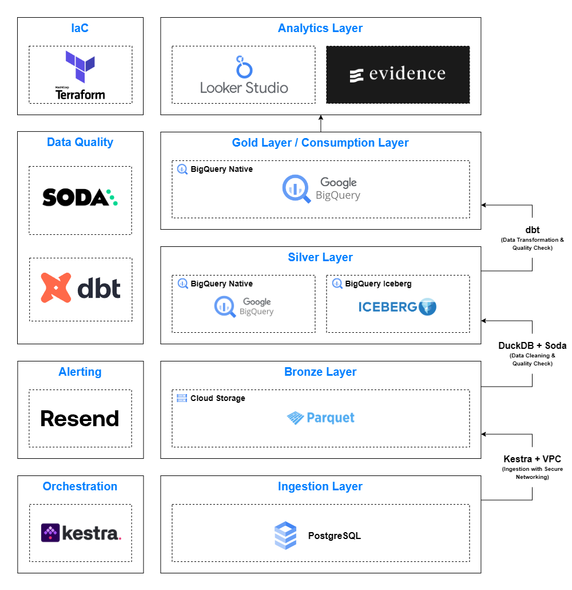

# GCP Infrastructure for Batch Processing

This project sets up a lightweight and cost-effective batch processing infrastructure for data platform on GCP. It is designed for small-to-medium-scale data processing tasks, leveraging GCP services like Cloud SQL, VPC, Compute Engine, Cloud Storage, and BigQuery.

## Components

| **Category**           | **Tool/Technology**                     | **Details**                               |
|------------------------|-----------------------------------------|-------------------------------------------|
| Infrastructure-as-code | Terraform                               | Automates infrastructure management.      |
| Data Source            | Pagila                                  | Sample PostgreSQL database.               |
| Orchestration          | Kestra                                  | Coordinates workflows and tasks.          |
| Ingestion              | Kestra                                  | Manages data ingestion workflows.         |
| Storage                | Google Cloud Storage (GCS) and BigQuery | Stores data using Medallion Architecture. |
| Processing             | DuckDB and dbt+BigQuery                 | Performs data transformation.             |
| Data Quality           | Soda and dbt test                       | Ensures data accuracy and reliability.    |
| Alerting               | Resend                                  | Sends email notifications for issues.     |
| Consumption            | BigQuery                                | Data consumption layer.                   |
| Analytics              | Looker Studio and Evidence              | Analytics and visualizations layer.       |

## Architecture Diagram

